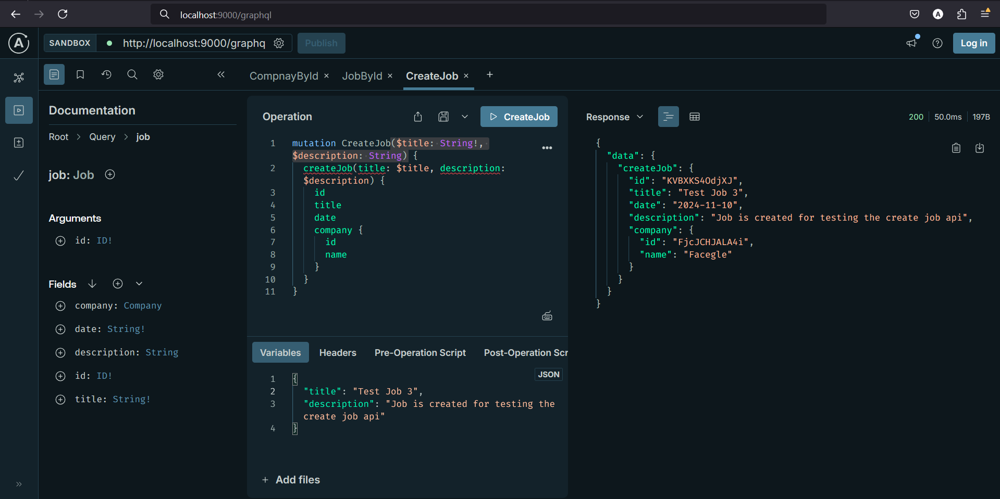
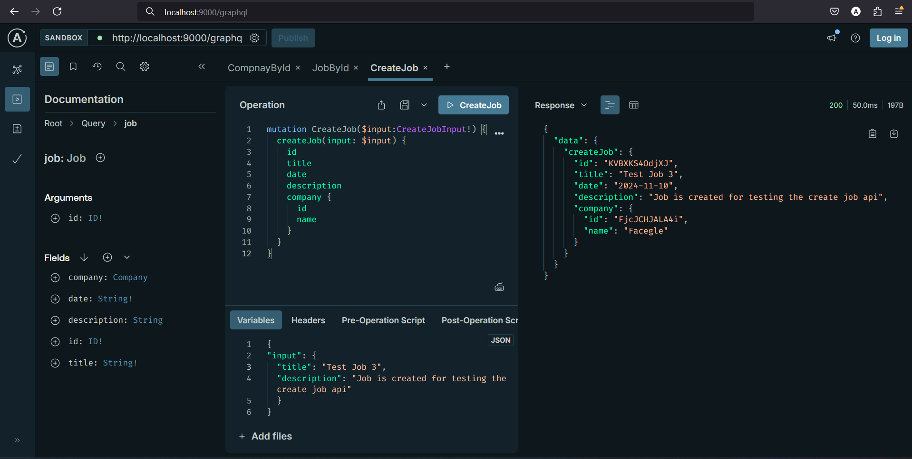

# GraphQL Job Board

It uses Apollo Server with Express, and GraphQL-Request and Apollo Client as GraphQL clients. The application is used to explain queries, mutations, custom object types, authentication, etc.

### Create Job Mutation Approach 1 Test Case

### Create Job Mutation Approach 2 Test Case
